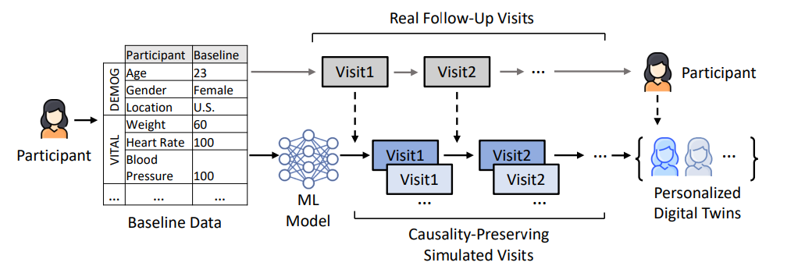
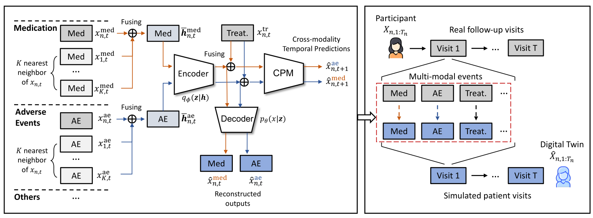

# TWIN: Personalized Clinical Trial Digital Twin Generation

**Trisha Das1**  
Department of Computer Science,  
University of Illinois  
Urbana-Champaign  
Urbana, IL, USA  
trishad2@illinois.edu  

**Zifeng Wang1**  
Department of Computer Science,  
University of Illinois  
Urbana-Champaign  
Urbana, IL, USA  
zifengw2@illinois.edu  

**Jimeng Sun**  
Department of Computer Science,  
University of Illinois  
Urbana-Champaign  
Urbana, IL, USA  
jimeng@illinois.edu  

2023  

---

## Abstract  
Clinical trial digital twins are virtual patients that reflect personal characteristics in a high degree of granularity and can be used to simulate various patient outcomes under different conditions. With the growth of clinical trial databases captured by Electronic Data Capture (EDC) systems, there is a growing interest in using machine learning models to generate digital twins. This can benefit the drug development process by reducing the sample size required for participant recruitment, improving patient outcome predictive modeling, and mitigating privacy risks when sharing synthetic clinical trial data. However, prior research has mainly focused on generating Electronic Healthcare Records (EHRs), which often assume large training data and do not account for personalized synthetic patient record generation. In this paper, we propose a sample-efficient method TWIN for generating personalized clinical trial digital twins. TWIN can produce digital twins of patient-level clinical trial records with high fidelity to the targeting participant's record and preserves the temporal relations across visits and events. We compare our method with various baselines for generating real-world patient-level clinical trial data. The results show that TWIN generates synthetic trial data with high fidelity to facilitate patient outcome predictions in low-data scenarios and strong privacy protection against real patients from the trials.  

**Keywords**: Digital twin, Synthetic data, Clinical trial  

---

## Figure 1  
  
*An illustrative example of the process of generating personalized clinical trial digital twins based on the real follow-up visits recorded in real clinical trial data.*  

---

## 1. Introduction  
Clinical trials are prospective studies that aim to compare the effects and value of new interventions in human subjects. They typically recruit tens to hundreds of participants and can take several years to complete. With the rapid expansion of clinical trial data, there is a growing interest in using *Digital Twins* to simulate patient outcomes. Digital twins are virtual patients that reflect personal characteristics in a high degree of granularity and can be used to simulate various patient outcomes under different conditions. The use of digital twins in clinical trials offers several benefits, such as  

- Reducing the sample size required for participant recruitment by using predictive modeling to obtain outcomes for each patient under different arms, thus accelerating the drug development process.  
- Generating synthetic patient records to mitigate privacy risks when sharing real clinical trial data.  

The closest analog to the generation of digital twins for clinical trials is the generation of electronic healthcare records (EHRs). In particular, deep generative models such as generative adversarial networks (GANs) and variational autoencoders (VAEs) have been used to generate synthetic EHRs while preserving the statistical patterns of real EHRs (Bernard et al., 2017; Li et al., 2018; Zhang et al., 2019; Liu et al., 2020). These synthesized EHRs can then be used to develop health risk predictive models. However, there are several key differences between the generation of digital twins for trials and the generation of synthetic EHRs:  

- The structure and temporal patterns of clinical trial data differ substantially from those of EHRs (Bernard et al., 2017). Clinical trial data is less sparse and more regular in terms of event incidence patterns and intervals and has a much smaller sample size, which limits the use of large models. Hence it is suboptimal to apply EHR generation methods to clinical trial data.  
- The main objective of generating synthetic EHRs is to capture the global characteristics of real EHR data, whereas the goal of generating digital twins is to create virtual patients that fit personal characteristics with high fidelity, utility, and diversity.  

To be specific, the process of generating clinical trial digital twins can be broken down into three main steps, as illustrated in Fig. 1. Step one involves collecting the participant's baseline data at the time of admission. In step two, the participant's follow-up visits are recorded, and a machine learning model is used to simulate virtual visits based on the real visits and the patient's characteristics. Finally, in step three, personalized digital twins are generated based on the real participant record. By adjusting inputs such as the assigned treatment to the participant, it is possible to simulate the patient's trajectory in counterfactual scenarios.  

Concretely, we propose a framework for personalized clinical Trial digital **tWIN** generation (TWIN). Our main contributions are summarized as follows.  

- *To the best of our knowledge, we are the first to concentrate on personalized trial digital twin generation, whereas previous works only consider generating synthetic clinical trial data that are aligned with the real data in global statistics.*  
- *We propose a generative model that produces digital twins with high fidelity to mimic real participants, utilizes information from most similar participants, and preserves the causality across visits and events.*  
- *Our model can also simulate a patient's probable trajectory in a counterfactual scenario, i.e., if the patient were assigned to a different arm of the trial.*  

The rest of this paper is organized as follows: In §2, we review the related work in the literature. In §3, we dive into the proposed framework in detail. In §4, we present the results of our experiments. Finally, in §5, we provide a conclusion and discuss the directions for future work.  

---

## 2. Related Work  

### 2.1 Patient Outcome Prediction  
The rapid expansion of EHR data from millions of patients has rendered a profound impact on the data analytic modeling paradigm in healthcare (Kumar et al., 2019). Deep learning has been widely employed to encode the longitudinal patient records and then predict the patient health risk (Berger et al., 2017) or the disease progression (Liu et al., 2018). There are two main categories of EHR predictive modeling tasks studied: risk detection and sequential prediction of clinical events (Kumar et al., 2019). Risk detection seeks to predict the risk of the target event, e.g., disease onset, taking EHRs as inputs. The risk detection is formed in three types: First, as either binary classification (e.g., the onset of a specific disease (Berger et al., 2017; Li et al., 2018; Kummel et al., 2018) or mortality (Miller et al., 2016)); Second, as multi-class classification (e.g., disease stage prediction (Berger et al., 2017) and disease categories (Miller et al., 2016)); Third, as multi-label classification (e.g., diagnosis code assignment (Berger et al., 2017)). Sequential event prediction seeks to make a multi-label classification for multiple events at once (Berger et al., 2017; Li et al., 2018; Kummel et al., 2018; Miller et al., 2016).  

Patient predictive modeling is also the core to developing personalized medicine that identifies differences in treatment response and incidence rate of adverse effects based on individuals in clinical trials (Miller et al., 2016). However, the area of clinical trial predictive modeling has been less explored than EHRs. Most works focus on the predictive modeling of specific diseases (Li et al., 2018; Kummel et al., 2018; Miller et al., 2016; Mili et al., 2018) or of tabular clinical trial data (Miller et al., 2016). Directly adopting EHR sequence modeling to clinical trial data would yield suboptimal results due to the limited size of the data. One reason is the nature of clinical trials where each trial only recruits hundreds to thousands of participants at most. The other reason is that the privacy issue jeopardizes access to clinical trial data. Our work aims to handle these challenges in two aspects: augmenting clinical trial data to offer a sufficient amount of data for deep learning models and generating synthetic clinical trial data to be around the privacy risk of sharing real trial data.  

### 2.2 Synthetic Patient Record Generation  
Generating synthetic patient records is a promising solution to the privacy concerns that arise from the release of health-related data across institutions (Rosenblatt et al., 2000). Research in this field primarily focuses on generating synthetic EHRs using generative adversarial networks (GANs) (Berger et al., 2017; Li et al., 2018; Kummel et al., 2018; Mili et al., 2018), variational autoencoders (VAEs) (Li et al., 2018; Kummel et al., 2018; Mili et al., 2018), and language models (Miller et al., 2016). The goal of this line of research is to align global statistics as closely as possible with real EHRs. The generated synthetic data unlocks the collaboration across institutes on developing AI algorithms based on healthcare data, mitigating the concern of regulatory, intellectual property, and privacy barriers. Following the success of synthetic EHR generation, research has also begun to study synthetic clinical trial data generation (Rosenblatt et al., 2000), e.g., synthetic tabular clinical trial data (Berger et al., 2017; Li et al., 2018). Nevertheless, these efforts often ignore the temporal structure of clinical trial data, making them unable to replicate the original clinical trial structure or use them for longitudinal modeling.  

Besides, there were efforts committed to using probabilistic graphical models to fit the temporal distribution of clinical trial data on specific diseases like Alzheimer's Disease (Berger et al., 2017) and Multiple Sclerosis (Miller et al., 2016). Nevertheless, they concentrated on estimating the uncertainty of patient trajectories and the predicted endpoints. The utility of generated clinical trial data remains vague. In contrast, TWIN is capable of augmenting the volume of clinical trial data that support the employment of more sophisticated machine learning models for advanced prediction performance.  

---

## 3. Method  

This section covers the main framework of TWIN, including the problem definition, workflow, and training task formulation. The methods for creating synthetic clinical trial data are also discussed. Additionally, the process for evaluating TWIN’s effectiveness in terms of quality, utility, and privacy preservation is outlined.  

### 3.1 Problem Formulation  

In a clinical trial, there are \( N \) participants. The \( n^{\text{th}} \) patient is represented by a sequence of visits in the temporal order as  
\[ X_{n;1:T_n} = \{x_{n,1}, x_{n,2}, \cdots, x_{n,T_n}\}, \]  
where \( x_{n,t} \) denotes the events that occurred during the patient’s \( t^{\text{th}} \) visit and \( T_n \) is the total number of visits for that patient. Each visit \( x_{n,t} \) constitutes sets of events as  
\[ x_{n,t} = \{x_{n,t}^{1}, x_{n,t}^{2}, \cdots, x_{n,t}^{U}\}. \]  
(1)  

## Figure 2 
 

**Figure 2**: The workflow of data generation based on TWIN. (Right) TWIN takes the real follow-up visits \(X_{n,1:T_{n}}\) then generates the simulated visits \(\hat{X}_{n,1:T_{n}}\). (Left) The detailed working process of TWIN reconstructs the raw medication and adverse events with VAE, enhanced by retrieval-augmented encoding. An additional Causality Preserving Module (CPM) takes the latent event embeddings and treatments then make the cross-modality temporal predictions, i.e., the events that occurred in the next timestamp. *Treat.* is short for treatment; *Med* is short for medication; *AE* is short for adverse event.

where \(U\) is the total number of event types in the data. An event set \(x^{u}_{n,t}\) contains a set of events of type \(u\) occurred at the \(t^{\text{th}}\) visit of patient \(n\), denoted by \(x^{u}_{n,t}=\{c_{1},c_{2},\ldots,c_{l}\}\). Here, each \(c_{l}\) is an indicator \(c_{l}\in\{0,1\}\) showing if the event \(l\) occurred or not.

Without the loss of generality, we focus on the three major types of events: *treatment*, *medication*, and *adverse events*. Treatment events, represented by \(x^{1}_{n,t}\), are the assigned treatment at the \(t\)-th timestep for the participant \(n\). Note that for patient \(n\), the treatment plan must be in line with the arm she was assigned to, such as the treatment arm \(\mathcal{T}\) or control arm \(C\). This means that for all participants in the same arm, their treatment schedule should be the same across the entire tracking period, as \(\{x^{1}_{n,1},x^{1}_{n,2},\cdots,x^{1}_{n,T_{n}}\}\) are the same for \(n\in\mathcal{T}\). Here, \(\mathcal{T}\) is a set of participants' indices in the treatment arm, and \(C\) represents the control arm. This feature separates clinical trial data from EHRs because we should strictly maintain the treatment schedule when generating the digital twins for targeting participants, while EHR generation models do not have this constraint.

Medication events, represented by \(x^{2}_{n,t}\) or \(x^{med}_{n,t}\), are additional medications given to the patient that is not being examined in the trial. Adverse events, represented by \(x^{3}_{n,t}\) or \(x^{ae}_{n,t}\), are the unexpected adverse events observed in each visit. We argue it is vital to consider the *causality* across these two types of events when generating personalized digital twins. For instance, medication *Acetaminophen* at timestep \(t+1\) might be provided by the doctors due to the adverse event *fever* that happened at timestep t. On the other hand, the *fever* symptom may not be present at timestep \(t+1\) as the response to taking *Acetaminophen* at timestep \(t\). It is challenging for EHR generation models to fully capture this causality because they generate synthetic data step by step from \(t=0\) to \(t=T\), which renders an accumulation of errors because a slight event modification at early timesteps will yield a significant perturbation of the entire patient trajectory.

Concretely, this paper proposes to generate personalized clinical trial digital twins that preserve the *cross-event temporal causality* while generating digital twins: (1) Adverse events of visit \(t+1\) depend on the treatments and medications provided in visit \(t\). (2) Medications for visit \(t+1\) are provided based on the treatment and adverse events in visit \(t\). In the next, we will elaborate on the details of TWIN that abides by the causal dependencies and the constraints regarding treatment during the generation of digital twins.

### 3.2 Input Encoding

The raw patient record \(X_{n;1:T_{n}}\) is defined by Eq. (1), which contains a sequence of \(T_{n}\) visits recorded during the clinical trial. As illustrated by Fig. 1, we seek to generate the digital twin \(\hat{x}_{n;1:T_{n}}\) that retains the characteristics of the targeting patient while being in diverse trajectories. In addition, we urge the generated digital twin to be aligned with the cross-event temporal causality, i.e., the arbitrary two generated adjacent visits need to satisfy the causality constraints across timesteps and events.

Concretely, we propose a generator \(f(\cdot)\) that simulates personalized patient trajectories conditioned by the real record \(X_{n;1:T_{n}}\), the \(K\) nearest neighbor patients \(\{X_{k;1:T_{n}}\}_{k}\), and the learned model parameters \(\Theta\), as

\[
\hat{X}_{n;1:T_{n}}=f\left(X_{n;1:T_{n}},\{X_{k;1:T_{k}}\}_{k};\Theta\right).
\]  
(3)

**Event Encoding.** The raw input \(X_{n;1:T_{n}}\) contains a series of visits \(x_{n,t}\), where each visit \(x_{n,t}\) consists of concurrent events in \(U\) different types, as \(x_{n,t}=\{x^{1}_{n,t},\ldots,x^{U}_{n,t}\}\). One event set \(x^{u}_{n,t}\) is converted to a multi-hot vector where each element indicates the occurrence of a specific event at this timestep, as \(x^{u}_{n,t}=\{c_{1},\ldots,c_{l}\}\in\{0,1\}^{l}\). The raw input \(x^{u}_{n,t}\) can be encoded into a dense embedding by \(\mathbf{W}_{\text{emb}}^{u}\in\mathbb{R}^{l\times d}\) as

\[
\mathbf{h}_{n,t}^{u}=x^{u}_{n,t}\cdot\mathbf{W}_{\text{emb}}^{u}\in\mathbb{R}^d,
\]  
(4)

where \(\mathbf{W}_{\text{emb}}^{u}\) is a trainable embedding matrix; \(d\) is the hidden dimension; \(\hat{\mathbf{h}}_{n,t}^{u}\) is the embedding in *event level*. Similarly, we can encode for \(u\in\{1,\ldots,U\}\) using \(\{\mathbf{W}_{\text{emb}}^{u}\}_{u}^{U}\) to \(\{\mathbf{h}_{n,t}^{u}\}_{u}^{U}\).

**Retrieval-Augmented Encoding.** We propose to leverage an indexed retriever to augment the input encoding, i.e., retrieval-augmented encoding. In detail, for the targeting visit \(x_{n,t}\), we retrieve \(K\) visits \(\{x_{k,t^{\prime}}\}_{k}^{K}\) from all the other patients with the highest similarity to \(x_{n,t}\). Note that \(t^{\prime}\) can be either equal or unequal to \(t\). To keep the process efficient, we employ dot-product similarity for every pair \(\{x_{n,t},x_{k,t^{\prime}}\}\) based on the multi-hot encoded inputs and then rank to solicit the top \(K\) similar visits.

After that, we draw the events of type \(u\) from the retrieved results, as \(\{x_{k,t^{\prime}}^{u}\}_{k}^{K}\), and encode them to dense embeddings \(\{\mathbf{h}_{k,t^{\prime}}^{u}\}\) using \(\mathbf{W}_{\text{emb}}^{u}\). We further consider dynamically assigning importance weights for the retrieved results when fusing them using attention, as  

\[
\begin{split}
\tilde{\mathbf{h}}_{n,t}^{u} &= \text{Softmax}(x_{n,t} \cdot X_{n,K}^{\top}) \cdot \mathbf{H}_{n,K}^{u} = \sum_{k\in\mathcal{K},i\in \mathcal{I}} \alpha_{i}k, \\
&\text{where } \mathcal{K} = \{\mathbf{h}_{n,t}^{u}\} \cup \{\mathbf{h}_{k,t^{\prime}}^{u}\}_{k}^{K}, \mathcal{I} = \{1,\cdots,K+1\}.
\end{split}
\]  
(5)

And we have  

\[
X_{n,K} = [x_{n,t} \oplus \{x_{k,t^{\prime}}\}_{k}^{K}] \in \{0,1\}^{(K+1)\times \sum_{u}l_{u}}
\]  
(6)  

that is the concatenated input records. In particular, \(l_{u}\) is the total number of unique events of \(u\)-th modality, e.g., the number of unique medications; \(\alpha_{k}\) are affinity scores that measure the degree of similarity of the retrieved visits to the targeting visit; \(\mathbf{H}_{n,K}^{u} = [\mathbf{h}_{n,t}^{u} \oplus \{\mathbf{h}_{k,t^{\prime}}^{u}\}_{k}^{K}] \in \mathbb{R}^{(K+1)\times d}\) is the embedding matrix by concatenating all the encoded visit embeddings. In this way, the aggregated embedding \(\tilde{\mathbf{h}}_{n,t}^{u}\) incorporates the information from a larger pool of data and mitigates overfitting.

### 3.3 Digital Twin Generation  

With the encoded input events \(\tilde{\mathbf{h}}_{n,t}^{u}\), our method TWIN can perform two tasks for digital twin generation:  

**Personalized Generation**. The goal of this task is to generate synthetic patient records that are diverse and closely resemble the target patient records. This task allows personalized augmenting the existing patient records with synthetic records generated by the learned generative model.  

The digital twin generation tasks are supported by a Variational Auto-Encoder (VAE) that consists of an encoder \(q_{\phi}(\mathbf{z}|\mathbf{h})\) and a decoder \(p_{\theta}(x|\mathbf{z})\). For clarity, we use the abbreviated notation \(\mathbf{h}\) and \(x\) instead of \(\tilde{h}_{n,t}^{u}\) and \(x_{n,t}^{u}\), respectively. These two notations will be used interchangeably from this point forward. Formally, we parameterize the encoder \(q_{\phi}(\mathbf{z}|\mathbf{h})\) using Gaussian distribution, as \(q_{\phi}(\mathbf{z}|\mathbf{h})=\mathcal{N}(\mathbf{z}|\mu,\sigma\cdot I_{d})\). The sampling process is:  
1. Obtain the mean and variance of the Gaussian distribution from the encoder, i.e., \(\{\mu(\mathbf{h}),\sigma(\mathbf{h})\}\sim q_{\phi}(\mathbf{z}|\mathbf{h})\).  
2. Sample a random noise \(\epsilon\) from a standard normal distribution, i.e., \(\epsilon\sim\mathcal{N}(0,I_{d})\).  
3. Transform the noise by scaling it with the obtained variance, and adding it to the mean, as \(\mathbf{z}=\mu(\mathbf{h})+\sigma(\mathbf{h})\cdot\epsilon\).  

We further introduce a **Causality Preserving Module (CPM)** that takes \([\mathbf{z}\oplus x_{n,t}^{1}]\) as input and outputs estimated next step's events of a specific type depending on the input event type. For example, when the input is medication, the corresponding event type that CPM learns for the next step is the adverse event (orange arrows in Fig. 2) and vice versa (blue arrows in Fig. 2). The decoder \( p_{\theta}(x|z) \) accepts the latent embedding \( z \) and then generates \( \hat{x}_{n,t}^u \). We repeat this process for all \( t \in \{1, \ldots, T\} \) and for all \( u \in \{1, \ldots, U\} \) except for the treatment event, which yields a personalized digital twin \( \hat{X}_{n,1:T} = \{\hat{x}_{n,t}\}_{t=1}^{T} \) that closely resemble the real record \( X_{n,1:T} \).

**Counterfactual Generation.** This task aims to simulate patient trajectories under a different treatment schedule. For example, switching a patient from the treatment arm (\( \mathcal{T} \)) to the control arm (\( C \)). This task not only augments patient records but also provides a route for estimating individualized treatment effects. Additionally, it helps balance the trial data for predictive modeling and significantly reduces the sample size required for recruiting control arm participants.

Counterfactual generation starts from searching \( \tilde{X}_{k,1:T_k} \) that is the most similar patient record to \( X_{n,1:T_n} \), where \( n \in \mathcal{T} \) and \( k \in C \). Using the baseline feature of the patient \( n \), the model then generates a synthetic trajectory based on the record of patient \( k \). In this way, the generated counterfactual digital twin \( \hat{X}_{n,1:T_n} \) entails both the personal characteristics of patient \( n \) and the temporal pattern of patient \( k \).

### 3.4 Training  

Our training loss consists of two parts, as described below:  

**Generative Loss.** The loss function for the VAE consists of reconstruction loss and KL divergence. Minimizing this loss is equivalent to maximizing the Evidence Lower Bound. We use binary cross entropy as the reconstruction loss.  

\[
\mathcal{L}_1 = -\sum_{j=1}^{l_u} \sum_{n=1}^{N} \sum_{t=1}^{T_n} \left(x_{n,t}^{u,j} \log(\hat{x}_{n,t}^{u,j}) + (1 - x_{n,t}^{u,j}) \log(1 - \hat{x}_{n,t}^{u,j})\right) + \sum_{n=1}^{N} \sum_{t=1}^{T_n} D_{KL}(q_{\phi}(z|h)||p_{\theta}(z)).
\]  

Here, \( T_n \) is the number of visits of patient \( n \), \( \hat{x}_{n,t}^{u} \) is the reconstructed version of \( x_{n,t}^{u} \) we get from the decoder of the VAE. \( p_{\theta}(z) \) is the prior distribution \( \mathcal{N}(z|0, I_d) \). \( l_u \) is the dimension of the multihot vector \( x_{n,t}^{u} \).  

**Causality-preserving Loss.** The hidden representation \( z \) of event type \( u \) is concatenated with treatment \( x_{n,t}^{1} \) to predict the next timestep \( (t+1)^{\text{th}} \) event type \( u' \neq u \). For example, the predictor in Fig. 2 is a neural network that estimates the next step’s adverse events with the input medication representation (orange arrows). Formally, the causality-preserving loss is  

\[
\mathcal{L}_2 = -\sum_{j=1}^{l_u'} \sum_{n=1}^{N} \sum_{t=1}^{T_n-1} \left(x_{n,t+1}^{u',j} \log(\hat{x}_{n,t+1}^{u',j}) + (1 - x_{n,t+1}^{u',j}) \log(1 - \hat{x}_{n,t+1}^{u',j})\right),
\]  

where \( \hat{x}_{n,t+1}^{u'} \) is predicted next step events of type \( u' \) which has a causal relationship with the input event type of TWIN. \( l_u' \) is the dimension of the multihot vector \( x_{n,t+1}^{u'} \). The reason why we include \( \mathcal{L}_2 \) is to urge TWIN to learn to generate a variant of input events that are aligned with the events in the next step satisfying the temporal causal relations, hence yielding synthetic visits with high fidelity.  

## 4. Experiments  

In this section, we present the experiment results that assess TWIN in three different aspects:  

- **Fidelity**: The degree to which the synthetic data generated by TWIN resembles real clinical trial data.  
- **Utility**: The usefulness of the synthetic data for downstream predictive tasks.  
- **Privacy**: The extent to which the synthetic data protects the privacy of individuals in real trial data.  

### 4.1 Experimental Setup  

#### 4.1.1 Data Source  
The statistics of these datasets are summarized in Table 1. The first dataset is a phase III breast cancer clinical trial (NCT00174655). There is a total of 2,887 patients who were randomly assigned to the arms to evaluate the activity of Docetaxel, given either sequentially or in combination with Doxorubicin, followed by CMF, in comparison to Doxorubicin alone or in combination with Cyclophosphamide, followed by CMF, in the adjuvant treatment of node-positive breast cancer patients. The second dataset is a Small Cell Lung Carcinoma clinical trial dataset (NCT01439568). This Phase II trial dataset contains data from both the comparator and experimental arms. 90 patients were randomly assigned to the arms to test the effect of LY2510924 and Carboplatin/Etoposide Versus Carboplatin/Etoposide in Extensive-Stage Small Cell Lung Carcinoma. We downloaded and processed the publicly available dataset from Project Data Sphere [2]. The first dataset is used to assess our algorithm's performance in terms of fidelity, utility, and privacy. The second dataset tests the model's utility performances in a very small dataset scenario.  

#### 4.1.2 Data Preprocessing  
We extracted the medications, treatments, and adverse events from the raw clinical trial data. We kept the top 100 frequent medications from each dataset. For adverse events, we selected the top 50 frequent ones. We then combined all rare events (frequency < 50) as one extra adverse event representing all rare adverse events.  

#### 4.1.3 Baseline Models  
We compare TWIN with these methods that work for synthetic EHR generation and clinical trial data generation:  

- **EVA [6]**: A generative model for generating synthetic electronic health records using conditional variational autoencoders.  
- **SynTEG [39]**: A generative model for generating synthetic electronic health record data using Wasserstein GAN.  
- **PromptEHR [31]**: A method for EHR generation with generative language models equipped with prompt learning.  
- **KNN-based method [4]**: A simple model that perturbs the real patient data by randomly extracting pieces from its nearest neighbors. It was proposed to generate tabular clinical trial data only.  

EVA, SynTEG, and PromptEHR are synthetic EHR generation models. These three models cannot abide by the constraints of specific treatment strategies for specific trial arms. Also, they are not for personalized synthetic records generation and thus do not apply to the digital twin generation. The KNN-based method was proposed for generating tabular clinical trial data. We adapt it for generating sequential records by perturbing on the visit level and then accumulating them patient-wise. Appendix A.3 contains the implementation details.  

**Table 2**: The AUROC scores for the severe outcome prediction task on the real and synthetic trial data, and a combination of both. *1xsyn* is short for synthetic data with 1× size of the corresponding real data. The best scores across a column are in bold. The performances better than the real data are underlined.  

| Model/Data       | Breast Cancer Trial | Lung Cancer Trial |  
|------------------|--------------------|------------------|  
|                  | 1xsyn. | real+1xsyn. | 1xsyn. | real+1xsyn. |  
| EVA              | 0.529 ± 0.01 | 0.760 ± 0.01 | 0.673 ± 0.02 | 0.662 ± 0.02 |  
| SynTEG           | 0.534 ± 0.02 | 0.680 ± 0.03 | 0.627 ± 0.02 | 0.669 ± 0.04 |  
| KNN              | 0.718 ± 0.04 | 0.750 ± 0.02 | 0.673 ± 0.04 | 0.658 ± 0.02 |  
| PromptEHR        | 0.761 ± 0.03 | 0.777 ± 0.02 | 0.640 ± 0.03 | 0.688 ± 0.04 |  
| TWIN             | **0.773 ± 0.01** | **0.781 ± 0.01** | **0.733 ± 0.03** | **0.742 ± 0.03** |  
| Real Data        | 0.771 ± 0.02 | 0.648 ± 0.02 |  